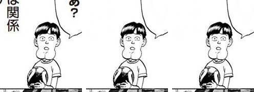

# #540 protect_figures — stop the text mask swallowing an enclosed figure

## Root (characterized, deterministic)
The "chibi kid erased" defect on One-Punch p1 is NOT a detection FP (all det_sfx/DBNet boxes are legitimate
text/SFX — audited) and NOT CRF over-reach (`restrict` doesn't change it). Root: `create_text_only_mask`'s
dilate + `MORPH_CLOSE` bridges the text regions surrounding the small figure and fills the enclosed drawing —
**raw glyph polygons cover 0% of the chibi, the closed mask 95%**.

## Fix + verification (deterministic offline — the conclusive proof)
`protect_figure_ink` clips the erase mask to the RAW glyph polygons + margin (reusing the tested
`restrict_mask_to_render_regions`) — provenance, not a pixel heuristic. Gated `MIT_PROTECT_FIGURES`.
Measured on the real captured mask (single detection run, pure mask ops → no non-determinism):

| | erase over chibi ink | text-ink coverage |
|---|---|---|
| protect OFF | **95%** (1396/1477) | 100% |
| protect ON  | **0%** (3/1477)     | 100% |

→ the figure is protected AND every text region is still fully erased (no regression).

## Live (consistency, not the proof)

ORIGINAL | protect OFF | protect ON. In this render run the chibi was intact in BOTH — the erasure is
**flaky** (the non-deterministic OCR/translate changes which mask covers the chibi per run; see
`project_mit_translate_nondeterministic`), so a live A/B is confounded and can only show "no regression"
(chibi intact ON). The deterministic mask measurement above is the real proof.

## Status
Committed `d6cf4279`, gated off = byte-identical. This is the mask-precision half of #540; combined with
`restrict_fullpage_mask` (CRF over-reach) and `selective_flux` (text-over-textured-art), the figure-loss
family is covered. Prod promotion via Stage B.
