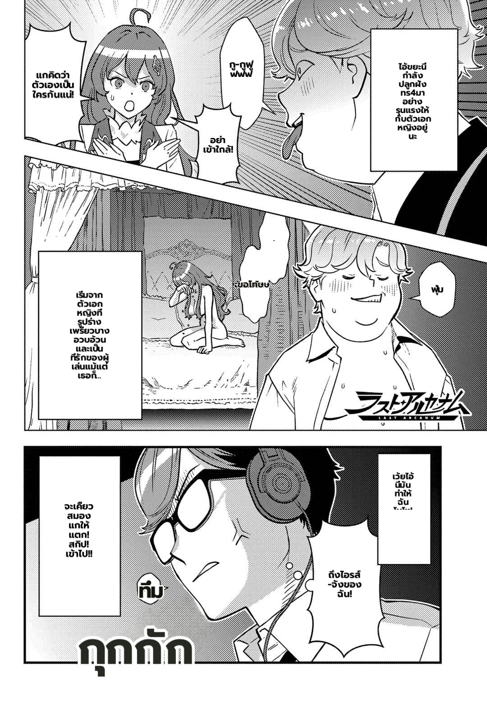

# Full-page-inpaint path verification (MIT_PATCH_FULLPAGE_INPAINT=1, prod default)

Prod runs the full-page inpaint path, which **skips** the per-crop guard/erase — it had to be
verified separately from the per-crop v16 result. Doing so **surfaced a real bug the per-crop runs
had only hidden by luck**: `custom_openai` (the prod translator) parsed its response with its OWN
inline positional `re.split(<|d|>)`, never touching the `numbered_contract` fix. A malformed marker
`<|10|` (no closing `>`) leaked into the rendered text and shifted DAMN→IRIS-CHAN's line.

Fixed: `parse_numbered_translations` (index-based + malformed-marker tolerant). Verified on the
full-page path across **2 consecutive non-deterministic runs**:

| run | regions | leaked markers | DAMN bubble |
|---|---|---|---|
| 1 | 15 | **0** | correct (own translation) |
| 2 | 15 | **0** | correct (own translation) |

`changed_alpha` (overlap-safe patch alpha) applies on both paths (outside the per-crop `else`); on the
full-page path the whole page is inpainted once so the ME OFF ghost can't recur regardless. **Both the
per-crop (v16) and full-page paths now render this page clean.** Residual: a minor OCR content slip
("TR4UMAS"→"ทร4มา") — an OCR-read nit, not a render defect class.
