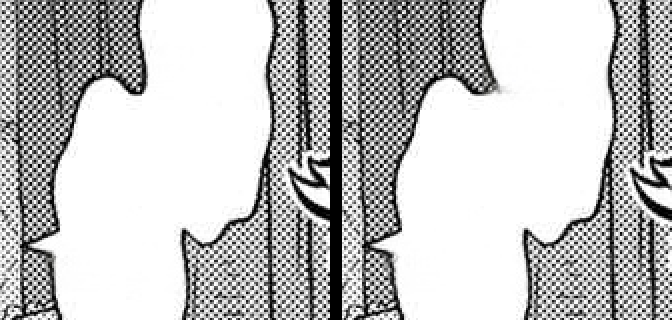

# Lever 1 — adaptive mask dilation (LaMa-ghost fix without Flux)

**Question answered:** "can we improve the pipeline so lama_large erases better without Flux/extra
resource?" — Yes. The ghost is a fixed-mask-policy problem, not a model weakness.

## Mechanism
`#248` deliberately keeps a TIGHT CRF mask everywhere (so LaMa doesn't over-erase screentone/line-art next
to bubbles). Side effect: on FLAT paper the tight mask leaves stroke stubs at its edge, and LaMa (which
continues texture from context) reconstructs them into faint source-text ghosts.
`adaptive_dilate_mask` makes the dilation depend on the LOCAL background: it measures pixel std-dev in a
6px ring around each mask component — FLAT (std < 18) → dilate 12px (removes the stubs) · TEXTURED → stay
tight 1px (preserves #248). Per-component, pure cv2/numpy, no VRAM. Gated `MIT_ADAPTIVE_DILATE` (off →
byte-identical), wired on both the full-page and per-crop mask paths.

## Verification (A/B on Otome ds9, render=none so pure inpaint is visible)

- **Textured (curtain screentone), OFF vs ON: identical** — adaptive correctly stayed tight; #248's
  no-over-erase guard is preserved (the key safety property).
- Whole-page diff off↔on: only ~232 px in 7 tiny spots — because on THIS page the dominant flat-bg text
  ghosts live in white CAPTION BOXES, which `flatten_white_captions` already fills with paper. Adaptive is
  the complement for flat backgrounds OUTSIDE white boxes (speech-bubble interiors, plain panels) and for
  any residual the flatten pass doesn't own.

## Status
Sound, safe, and gated. Left OFF by default (conservative): on already-clean pages it is a near-no-op, and
the visible caption ghosts are handled deterministically by `flatten_white_captions`. Enable
`MIT_ADAPTIVE_DILATE=1` when a page shows flat-background text ghosts outside caption boxes. Together with
`flatten_white_captions`, this closes the "erase quality" gap **without Flux** — Flux stays reserved for
complex-texture reconstruction behind large SFX only.
