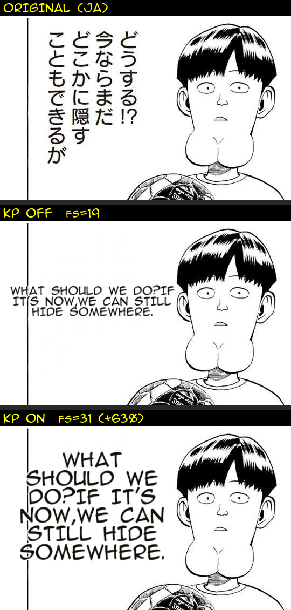
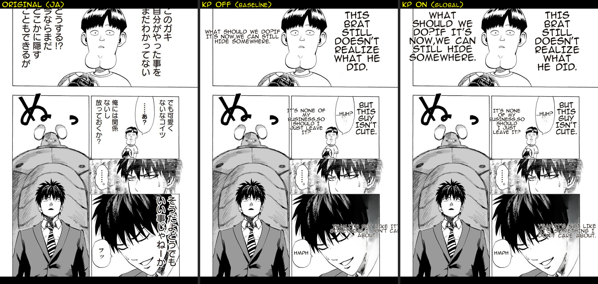

# Benchmark — #545 Knuth–Plass narration "oversize" regression (deterministic reproduction)

**Date:** 2026-07-06 · **Issue:** #545 (KP line-break enable gate) · **Related:** #180 (closed, pure module), deploy rollback `0111c229`

## What this proves

Enabling Knuth–Plass line-breaking **globally** (main's `render.knuth_plass` → `set_default_line_breaker`) inflates **clean-layout narration** font size, reproducing the exact defect that got `MIT_KNUTH_PLASS` rolled back in production. This benchmark is the evidence that #545's remaining wiring must be **per-region** (bubble dialogue only; clean_layout/narration → force greedy), **not** a global switch — and confirms the `bubble_area_fit`-gated wiring in PR #425 is unsafe (that gate is ON in prod).

## Method (deterministic, no ML / no worker / no network)

The translator is non-deterministic (OCR-VLM + API LLM sampling), so a live ON/OFF A/B is confounded (see `project_mit_translate_nondeterministic`). Instead:

1. **Freeze once** — `tools/bench_dump.py` runs the real pipeline in-process on the One-Punch benchmark page (`BENCHMARK.md`) with the prod render-parity config, and pickles the **pre-render** Context (`img_inpainted` + `img_rgb` + `text_regions` + `page_shape`) right before the render stage. 7 regions captured — all narration (`bubble=False`), including the report's named case "THIS BRAT…" and one SFX ("HMPH").
2. **Replay twice** — `tools/bench_replay_kp.py` deep-copies the frozen regions and replays **only** `run_text_rendering` on **main's** code with `knuth_plass=False` (baseline) vs `True` (global). Identical input, single knob → every pixel difference is 100% the line-breaker.

Run:
```bash
# on the pipeline tree (loads models + one API translate):
.venv/Scripts/python.exe tools/bench_dump.py <one-punch.jpg> tools/_kp545/onepunch_fixture.pkl ENG
# on origin/main (pure render, CPU only):
<main-venv>/python.exe tools/bench_replay_kp.py .../onepunch_fixture.pkl tools/_kp545_out
```

## Result — before → after (font size per region, ON/OFF)

| Region | source text | fs OFF | fs ON | Δ | ratio |
|---|---|---:|---:|---:|---:|
| **[0]** | WHAT SHOULD WE DO? IF IT'S NOW… | **19** | **31** | **+12** | **1.63 ⟵ BLOAT** |
| [3] | IT'S NONE OF MY BUSINESS… | 18 | 20 | +2 | 1.11 |
| [1] | THIS BRAT STILL DOESN'T REALIZE… | 35 | 35 | 0 | 1.00 |
| [2] | …HUH? | 19 | 19 | 0 | 1.00 |
| [4] | BUT THIS GUY ISN'T CUTE. | 27 | 27 | 0 | 1.00 |
| [5] | YEAH, IT'S NOT LIKE… | 18 | 18 | 0 | 1.00 |
| [6] | HMPH (sfx) | 18 | 18 | 0 | 1.00 |

**Worst font-size ratio ON/OFF: 1.63× — regression reproduced.**

**Focus crop (region [0], on clean white background — the clearest view of the regression):**



Top = original (JA), middle = KP OFF (fs=19, narration sits small at top-left), bottom = KP ON (fs=31, +63% — balloons to dominate the panel). KP's balanced (wider) lines feed the clean-layout font-fit, which then grows the font to fill the box; greedy's raggeder wrap keeps more lines so the font stays capped.

**Full-page montage (context):**



> **Note on background quality:** this benchmark ran on `origin/main` whose inpainter is `lama_large`. LaMa leaves faint ghost/smudge bands where JA text was erased on **dark/textured** panels (bottom-right) — a known LaMa limitation, **identical in KP OFF and KP ON** (same frozen `img_inpainted`), so it does not affect the font-size A/B. The best-quality inpaint is on `landing/render-phase0` via **#421 selective Flux** (commit `9ce97b85`, `2026-07-05-421-flux-hair-reconstruct.png`: LaMa smears the hair, selective-Flux reconstructs it) — a render-quality fix `main` still lacks (Stage C, #548). Region [0] above is on a white background so it is smudge-free regardless.

## Assessment

- **Fix-root:** ✅ isolates the regression to the KP line-breaker at the render sizing seam (not detection/OCR/translate) — deterministic, single-knob.
- **No-regression check:** dialogue-shaped narration ([1],[4]) is unaffected; only the wide/short narration box ([0]) inflates — matching the documented "narration oversize" class.
- **Completeness:** covers the *benefit* direction too — KP's line balancing is visible; the harm is purely the **font-fit coupling on clean_layout**, which per-region gating removes while keeping KP for bubble dialogue.
- **Limitation:** single page (7 regions). The enable decision in #545 should re-run this replay on the fix (per-region gating) and assert region [0] ratio returns to ~1.0 while Thai dialogue still wraps on word boundaries.

_Harness: `MIT/tools/bench_dump.py` (freeze) + `MIT/tools/bench_replay_kp.py` (deterministic render replay) — reusable groundwork for the render-regression gate (Fix 3)._
