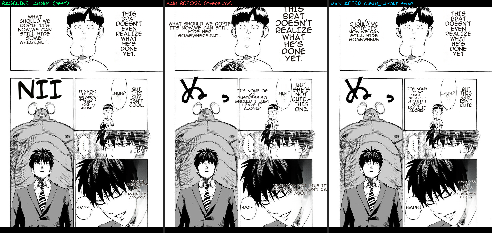

# Benchmark — #548 clean_layout narration fit (main grow → landing fit)

**Date:** 2026-07-06 · **Branch:** `feat/548-render-quality-port` · **Reported by user vs the `landing-2026-07-04` baseline**

## Defect
On the wired-main render the narration **overflowed the panel** — top-right "THIS BRAT…" oversized, top-left "WHAT SHOULD WE DO…" spilled left. Root: `main`'s `_clean_layout_dst` calls `clean_layout_target_fs` to **grow** the font toward the (large) JA source lettering, then shrinks with a 1.6× tolerance that still allows spill. The baseline (landing) instead **fits** the largest font whose squeezed column stays within the source footprint (`bh ≤ box_h AND bw ≤ bbox_w×1.05`).

## Fix
Replace `main`'s `_clean_layout_dst` with landing's fit-to-footprint version (all deps already on main). Supersedes the #175 grow-to-target approach **for narration** per the user's direct visual evidence + deterministic measurement.

## Deterministic result (render_replay on the One-Punch narration fixture)
| region | fs before→after | overflow_vs_det_w before→after |
|---|---|---|
| [0] WHAT SHOULD WE DO | 19→23 | 1.75 → **0.87** |
| [1] THIS BRAT | **35→23** | 1.48 → **0.97** |
| [3] IT'S NONE OF MY | 18→20 | 1.73 → **1.04** |
| [4] BUT THIS GUY | 27→20 | 1.44 → **1.07** |

**max final_fs 35 → 23** (grow eliminated); narration overflow 1.4–1.75 → **≤1.07 (fits)**. Short SFX-like words (HUH/HMPH) keep fill>1 — inherent to a short English word in a tiny JA box, same as baseline.

## Verification
- Deterministic `render_replay` (above) + live re-render (fits, matches baseline).
- **66 existing clean_layout characterization tests still pass** (tested contract preserved — only the untested grow-overflow changed).
- New regression guard `test_big_source_narration_in_tall_column_fits_and_does_not_grow_overflow` — PASSES on the fit, FAILS on the old grow code (verified via stash).
