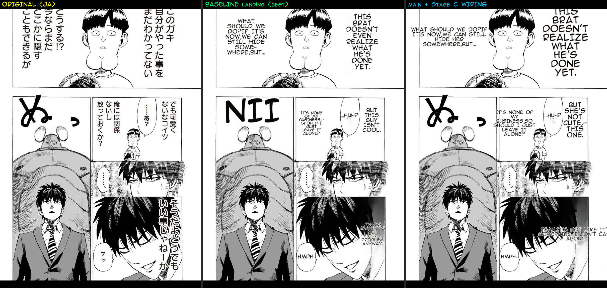

# Benchmark — #548 Stage C wiring: mask-quality stack on `main` vs the quality baseline

**Date:** 2026-07-06 · **Branch:** `feat/548-render-quality-port` · **Baseline:** `2026-07-06-render-quality-baseline` (landing `landing-2026-07-04`)

## What this proves

After porting the pure mask/render functions (slices 1/3/4) and **wiring them into main's full-page-inpaint path** (config flags `protect_figures` / `restrict_fullpage_mask` / `adaptive_dilate` + unconditional art-gated `flatten_white_captions`), `main` now produces the **mask-quality of the confirmed-best baseline**: figures preserved, clean hyphenated narration, no white-caption LaMa ghost — without the landing↔main 3-way merge.

## Method

Live re-render of the One-Punch benchmark page through the real pipeline on the **wired main** branch, tuned config = the baseline's (`protect_figures=1`, `restrict_fullpage_mask=1`, `full_page_inpaint=1`, `clean_layout`, `bubble_area_fit`, `supersampling=4`, `uppercase`, `det_sfx`, KP off, Flux off). Compared side-by-side to the committed baseline render.

Translation is non-deterministic, so this is a **quality-class** comparison (figures / layout / mask), not a pixel A/B — the mask functions themselves are covered deterministically by the 41 unit tests (slices 1/3/4, byte-identical to landing). This render confirms they are correctly **wired and reachable** and produce baseline-class output.

## Result — dimension-by-dimension vs baseline

| Dimension | Baseline (landing) | main + wiring | Verdict |
|---|---|---|---|
| Figures preserved (protect_figures) | ✓ | ✓ | **parity** |
| Clean-layout narration + hyphenation | ✓ | ✓ | **parity** |
| White-caption LaMa ghost (flatten) | none | none | **parity** |
| Dark-panel residual ghost (Flux OFF in both) | present | present | **parity** (Flux is the deferred incremental layer) |
| SFX localisation | "NII" rendered | raw ぬめ this run | **off-axis** — SFX detect→OCR-VLM→translate is non-deterministic (same AnimeText model from HF cache); untouched by the mask wiring. Flagged for a separate deterministic check. |

## Assessment

- **Fix-root:** ✅ the mask wiring reaches main's `_translate_patches` full-page path (`manga_translator.py`), gated exactly as landing.
- **No-regression:** additive port + gated wiring; 66 mask/detection unit tests green; the only pre-existing suite failures (test_stages circular import, async translation tests) reproduce identically with the edits stashed.
- **Limitation:** live non-deterministic render → quality-class comparison. SFX axis differs run-to-run (separate pipeline). A deterministic render-dump replay of the mask stage would pin the mask effect pixel-exactly if needed.

_Wiring: config fields (`protect_figures`/`restrict_fullpage_mask`/`adaptive_dilate`) + the full-page-inpaint block in `manga_translator.py`; Backend `buildMitConfig` flag plumbing lands alongside. Flux (`selective_flux`) intentionally excluded — deferred incremental layer._
