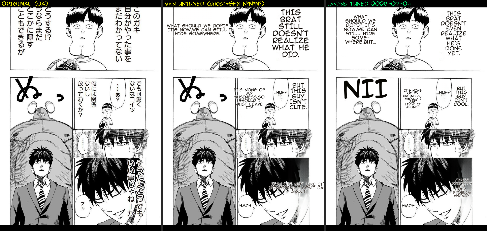

# Render-Quality Baseline — the "best version" (user-confirmed 2026-07-06)

**This is the render-quality bar. Every render change (and the Stage-C reconciliation) must be measured against this and must NOT regress it.**

- **Code:** `landing/render-phase0` render stack, `MIT_RENDER_VERSION=landing-2026-07-04`.
- **Confirmed best** by the developer on 2026-07-06 (rendered live, One-Punch benchmark page).
- **"Quality" = the whole tuned render**: text layout, SFX, translation, and font sizing — all tuned in the 2026-07-05 session. NOT inpaint alone, and **NOT** Flux (Flux is OFF here — it is only an incremental top layer for art-under-text edge cases).

Left = original (JA). Middle = `main` UNTUNED (raw JA SFX ぬネ, ghosting, plain layout) — representative of current prod/main. Right = **landing TUNED** (SFX rendered, hyphenated clean-layout narration, figures preserved, bubble-area-fit sizing).

Full tuned render: `./2026-07-06-render-quality-baseline-tuned.png`.

## The tuned config (Backend/.env, render_version `landing-2026-07-04`)

Reproduce with `MIT/tools/bench_render_tuned.py` on the landing render stack:

| Group | Setting |
|---|---|
| detector | `detection_size=2560`, `det_bubble_seg` (#170), `det_sfx` (#168 AnimeText) |
| ocr | `prob=0.03`, `vlm_rescue` (#168/#172) |
| inpainter | `lama_large`, `inpainting_size=2048`, `bf16`, `inpaint_context_pad=256`, `full_page_inpaint`, **`protect_figures`** (#540), **`restrict_fullpage_mask`** (#540), `selective_flux=OFF` |
| render | `clean_layout`, `bubble_area_fit` (#166/#175), `anti_overlap`, `font_size_max=20`, `knuth_plass=OFF`, `en_comic_font`, `en_font=anime_ace_3.ttf`, `uppercase`, `supersampling=4`, `patch_feather_radius=16` |

## Why current (main / perf) is worse — the Stage-C port list

The load-bearing quality lives in a render/mask stack present on `landing` ONLY — **absent from both `origin/main` and `perf` (prod)** (verified 2026-07-06):

| Fix | Flag / status | Kills |
|---|---|---|
| `flatten_white_captions()` | wired (detection_postproc.py) | LaMa smearing text in white caption boxes |
| adaptive mask dilation | `MIT_ADAPTIVE_DILATE` (config.py; not enabled in .env) | LaMa ghost on flat bg |
| protect figures | `MIT_PROTECT_FIGURES` | text erase-mask swallowing a figure (boy-ghost) |
| restrict full-page mask | `MIT_RESTRICT_FULLPAGE_MASK` | full-page erase over-reach |
| selective Flux | `MIT_SELECTIVE_FLUX` | hair/art under text — **incremental, OFF in baseline** |
| + ~30 more (`git log perf..landing`) | various | overlap-safe alpha, erase-own-balloon-ink, SFX font-cap, empty-balloon rescue, first-glyph-loss … |

**Stage C (#548) render-quality task:** port this stack (`config.py` fields + pipeline wiring) to `main`, then set the `MIT_*` flags in `buildMitConfig`, and re-render this page to confirm parity with the baseline above. Flux can follow as an optional later layer.

## Limitation

Translation text is non-deterministic, so the middle/right panels differ in wording — this is a **quality-of-render** reference, not a controlled A/B. The residual ghost in the dark bottom-right panel is the LaMa limit that selective Flux (OFF here) would close.
