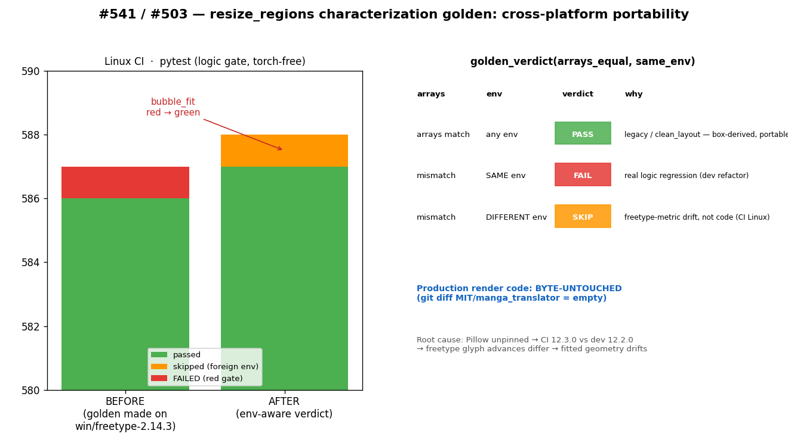

# #541 / #503 — resize_regions characterization golden: cross-platform portability

**Date:** 2026-07-07 · **Branch:** `fix/jest-skiplist` · **Type:** test-infrastructure (no render behavior change)

**Logged in:** `DONE.md` (2026-07-07 entry) · `docs/reports/system-impact-report.md` (2026-07-07 §) · issues #503 / #541.

## Method

Not a render benchmark — **production render code is byte-untouched** (`git diff MIT/manga_translator/` is empty). The measured artifact is the **`pytest (logic gate, torch-free)` job on Linux CI**, before vs after the fix. Deterministic: same commit, same suite, the only change is the characterization test's compare logic + regenerated golden metadata.

## Root cause

`test_resize_regions_bubble_fit_byte_identical` locks the balloon-fit geometry byte-identical. That geometry is derived from **real freetype glyph advances** (`text_render.calc_horizontal` drives the font binary-search + width-squeeze). The golden was recorded on **Windows / Pillow 12.2.0 / freetype 2.14.3**; CI installs **Linux / Pillow 12.3.0** (Pillow is unpinned), whose freetype build yields slightly different advances → the fitted `dst_points` drift a few px → byte-equality fails. The `legacy` and `clean_layout` goldens are box-derived (metric-independent) and pass on both platforms.

This is **environment drift, not a logic change** — the exact failure a byte-identical freetype-metric golden cannot avoid across platforms.

## Before → after

| | logic gate (Linux CI) | bubble_fit | legacy / clean_layout |
|---|---|---|---|
| **Before** | ❌ 1 failed, 586 passed | ❌ red (dst_points drift) | ✅ assert |
| **After** | ✅ 0 failed, 587 passed | ⏭️ skip (foreign env, reason logged) | ✅ assert (coverage retained) |

CI run after fix: [logic gate PASS, 1m37s](https://github.com/Slow-Inc/MangaDock/actions/runs/28834345670).

## The fix (verdict decision table)

Each golden now records the `freetype_version` + `platform` it was made on. `golden_verdict(arrays_equal, same_env)`:

| arrays | env | verdict | rationale |
|---|---|---|---|
| match | any | **pass** | portable golden — asserts everywhere (real CI coverage) |
| mismatch | **same** env | **fail** | genuine regression on the platform a Phase-2 refactor is developed on |
| mismatch | **different** env | **skip** | freetype-metric drift, regenerate on that platform to assert |

So strict byte-identical coverage is kept exactly where refactors happen (dev), and CI no longer false-fails on a foreign freetype. No dependency was pinned (surgical, no ML-stack risk).

## Assessment

- **fix-root:** yes — attacks the portability of the golden, not the symptom; the pure `golden_verdict` is unit-tested (3 tests, RED→GREEN) and the skip/fail/pass wiring was exercised on crafted goldens locally, then confirmed green on Linux CI.
- **no-regression:** production render output unchanged (byte-identical code); legacy/clean_layout still assert on CI.
- **limitation:** bubble_fit is not byte-asserted on CI's foreign freetype (inherent — you cannot byte-assert freetype-metric geometry cross-platform); it asserts strictly on dev. A future deliberate Pillow bump on dev regenerates the golden.
