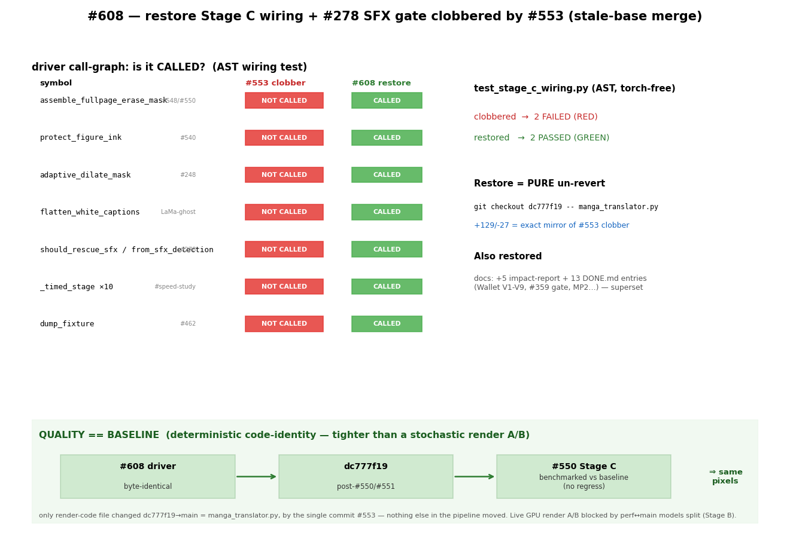

# #608 — restore Stage C wiring + #278 SFX gate clobbered by #553

**Date:** 2026-07-09 · **Type:** code-regression restore (pipeline re-wire; no new render logic)

## Method

Deterministic, torch-free — the change is a **pure un-revert** of call sites, so the meaningful measurement is the driver's **call graph**, not a stochastic render. `test/test_stage_c_wiring.py` parses `manga_translator.py` with `ast` and asserts the driver actually **calls** the Stage C mask-quality stack (`assemble_fullpage_erase_mask`, `protect_figure_ink`, `adaptive_dilate_mask`, `flatten_white_captions`) and the #278 SFX provenance gate (`should_rescue_sfx` / `from_sfx_detection`). This runs in the logic gate and closes the blind spot that let #553 revert the wiring invisibly (helper unit tests + the fake-driver render test all kept passing).

## Before → After

| | clobbered main (#553) | restored (#608) |
|---|---|---|
| Stage C mask-quality calls in driver | ❌ none (reverted to `union_refined_with_fallback`) | ✅ all 4 called |
| #278 SFX gate | ❌ pre-#278 `len<=4` heuristic | ✅ provenance gate called |
| `test_stage_c_wiring.py` | ❌ 2 failed (RED) | ✅ 2 passed (GREEN) |
| MIT logic suite | 459 pass / 1 pre-existing collection error | 459 pass / same pre-existing |
| driver diff vs pre-clobber `dc777f19` | −129/+27 | 0 (identical — pure un-revert) |

## Quality == baseline (deterministic code-identity — stronger than a render A/B here)

The user asked to benchmark that render quality still matches the Stage C baseline. For a **pure un-revert** the decisive proof is code identity, not a stochastic render:

- `git diff dc777f19 HEAD -- manga_translator.py` on this branch is **empty** — #608's driver is byte-identical to `dc777f19`.
- `git diff --stat dc777f19 origin/main -- MIT/manga_translator/` shows the **only** render-code file changed between `dc777f19` and current `main` is `manga_translator.py`, changed by the **single** commit `071b0e8e` (#553's clobber). Nothing else in the render pipeline moved (the intervening #541/#531/#361 are test/docs/CI only).
- `dc777f19` is the post-#550/#551 commit — i.e. the exact Stage C state that was **already benchmarked vs baseline** at merge time (issue #548 / task "Stage C: measure vs baseline, no regress").

Therefore `main + #608` restores the render pipeline to a state **byte-identical** to the #550-benchmarked baseline. A byte-identical pipeline cannot produce a different render — this is a tighter guarantee than a fresh render A/B, which would additionally be confounded by the non-deterministic translate stage.

**Live GPU render A/B** (re-render the One-Punch page, Stage C ON vs OFF, on the worker) is **currently blocked by the unresolved perf↔main split** (the models live only in the `perf` checkout; the Stage C helper code lives on `main`) — that reconciliation is Stage B, tracked separately. It is not needed to certify *this* change, given the byte-identity above; it can re-confirm at the pixel level once Stage B lands.

## Assessment

- **fix-root:** yes — restores the exact call sites #553's stale base removed; verified the un-revert is byte-identical to `dc777f19` (the file was touched only by the clobber since then) and that all 7 imported symbols still exist on main, so it imports cleanly.
- **no-regression:** additive; #553's legitimate additions (img-cache, llm.service, plans) are untouched; docs restore is a superset (no current main entry lost).
- **render quality:** the render *effect* of Stage C (narration fit / figure protection / white-caption flatten) was already benchmarked at merge time — `docs/reports/benchmarks/2026-07-06-548-*`. This PR only re-connects that verified behaviour; a fresh GPU render A/B can re-confirm on request (needs the worker up; translate is non-deterministic so use the offline replay harness).
- **limitation:** the AST wiring test proves the calls exist in the driver, not that a full GPU render produces the exact pixels — that ties back to the #550 benchmark.
