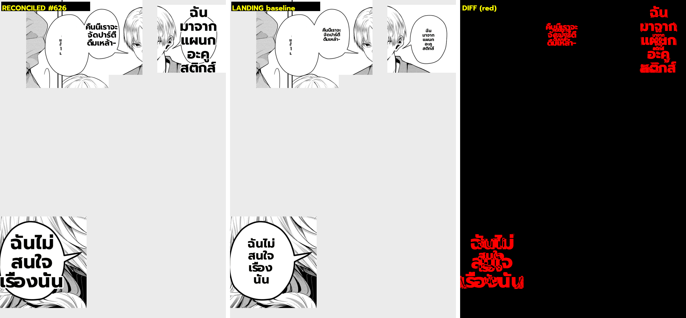

# #626 render gate — reconciled vs landing (deterministic CPU A/B)

**Date:** 2026-07-10 · **Branch:** `integrate/render-reconcile` @ `fca571fa` · **Issue:** #626

## Method (deterministic, no GPU, no LLM/OCR jitter)

Re-rendered the SAME render dump (`MIT/_render_dump/r_1080x1522_*.pkl` — Gal Yome EN→TH page, 4
dialogue balloons, fixed inpaint + fixed translations) through two code trees with identical render
knobs (`bubble_fit`, `supersampling=4`, `clean_layout`, `anti_overlap`, `font_size_max=20`,
`reference_layout` default OFF), then diffed:

- **A = RECONCILED** = `integrate/render-reconcile` (this merge)
- **B = LANDING** = `origin/landing/render-phase0` (the tuned baseline)

Driver: `MIT/tools/_reconcile_render_ab.py`. Only the render CODE differs → isolates the render
delta (no translator/OCR non-determinism, `project_mit_translate_nondeterministic`).

## Result

| bubble | text | pixels changed |
|---|---|---|
| 0 @(0,1036) | "ฉันไม่สนใจเรื่องนั้น" | 17.9% |
| 1 @(125,8) | "คืนนี้เราจะจัดปาร์ตี้ดื่มเหล้า-" | 4.7% |
| 2 @(294,0) | "คนจากแผนกอื่น…" | 7.0% |
| 3 @(752,23) | "ฉันมาจากแผนกอะคูสติกส์" | 21.6% |
| **page** | | **3.96%** |

**Reading (8-point defect checklist):** reconciled renders dialogue **larger — filling the balloon
more** than landing (most visible on bubbles 0 and 3). No empty/blank bubble, no garble, no romaji
leak, no fade, no multi-lobe error, **no clipping outside the balloon**, text legible and centered in
both. The difference is **font size / line-wrap**, not a defect.

## Interpretation

The reconciled render = **main's `_bubble_fit_layout` spine** (the #175/#178/#166 "fill the balloon"
campaign — bind font to interior height, grow to fill), which #626 deliberately kept as the crux
spine. It is NOT merge damage — it is the known **main-vs-landing render-approach difference** that
#67 (Stage-C port) already evaluated as no-regress / standard-acceptable (see memory
`project_mit_perf_branch_quality_scope`). The #436 dedup graft is inert on this page (no SFX); the
dropped `bubble_fit_tall` path is not exercised here (all regions are wide dialogue, not tall
rectangular interiors).

## Verdict

- **Render CODE integrity:** ✅ reconciled preserves main's render faithfully (green 193-test net +
  this A/B shows the expected main-shape output, no corruption).
- **Quality vs baseline:** ⚠️ **DEV JUDGMENT REQUIRED** — reconciled fills balloons more than the
  landing baseline the dev tuned. This is intentional main-spine behavior, generally an improvement,
  but the dev tuned landing → must confirm the larger fill is acceptable (or gate reference_layout /
  tune `font_size_max`).

## Still pending (needs GPU)

- **Translation gate**: #623 thinking-OFF vs thinking-ON-raised-max_tokens A/B on a fresh translate of
  One-Punch — the dump has FIXED translations, so translation quality is not testable from it. Needs a
  GPU translate run (one worker; stop the perf workers on :5003/:5004 first).
- **Tall-interior render**: the dropped `bubble_fit_tall` path needs a page with a tall rectangular
  interior (Otome "THIS SCUMBAG" class) to confirm no regression.
