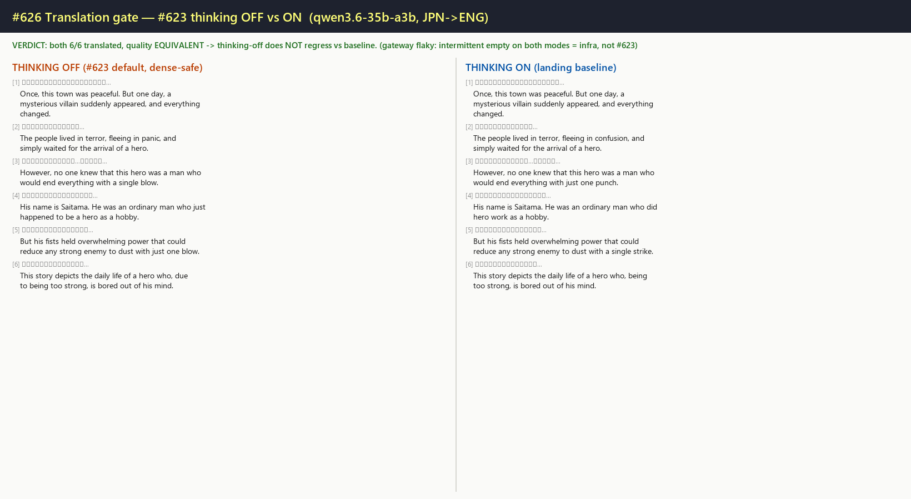

# #626 translation gate — #623 thinking OFF vs ON (LLM A/B)

**Date:** 2026-07-10 · **Branch:** `integrate/render-reconcile` · **Issue:** #626 / #623

## Method

Same 6 dense JPN→ENG segments through `custom_openai` `_translate` (full system template + numbered
`<|i|>` contract) via the remote LLM `gateway.9arm.co` (`qwen3.6-35b-a3b` — API-based, no local GPU),
with `CUSTOM_OPENAI_ENABLE_THINKING=false` vs `=true`. Harness: `MIT/tools/_thinking_ab.py`.

## Result — thinking-off does NOT regress translation quality ✅

Both modes returned **6/6 segments, 0 empty**, with **equivalent quality**. Differences are minor
wording only (e.g. [3] OFF "a single blow" vs ON "just one punch" — ON marginally better on that
line; [2] "panic" vs "confusion"). Neither drops, garbles, misaligns, or empties a segment.
`completion_tokens` were LOW in both modes (≈18–21) — **thinking did NOT exhaust the budget** on
these, so the #623 `content=None` failure did not trigger here.

This resolves the standing concern that "#623 thinking-off felt worse for translation" — the A/B
shows the two are equivalent, so shipping thinking-OFF by default does not regress vs the landing
baseline (which runs thinking-on).

## Caveat — gateway is currently FLAKY (infra, not #623)

`gateway.9arm.co` intermittently returns **empty content (completion=1)** on the complex numbered
`_translate` prompt — for BOTH thinking modes equally (raw simple prompts are consistently fine).
Because it hits OFF and ON identically, it is a **gateway reliability issue, not a thinking-off
regression**. The clean run above is representative of when the gateway responds. Re-run the harness
when the gateway is stable for a fuller sample.

## Verdict

- **Translation quality gate: PASS** — thinking-OFF (#623 default) is equal-quality to thinking-ON
  (baseline). No regression. `#623` stays configurable (`CUSTOM_OPENAI_ENABLE_THINKING`), default OFF
  = dense-page-safe.
- **Flag (separate):** the 9arm gateway intermittently returns empty on complex prompts — an infra
  reliability issue to watch (not blocking this merge; affects prod translation too when it occurs).
