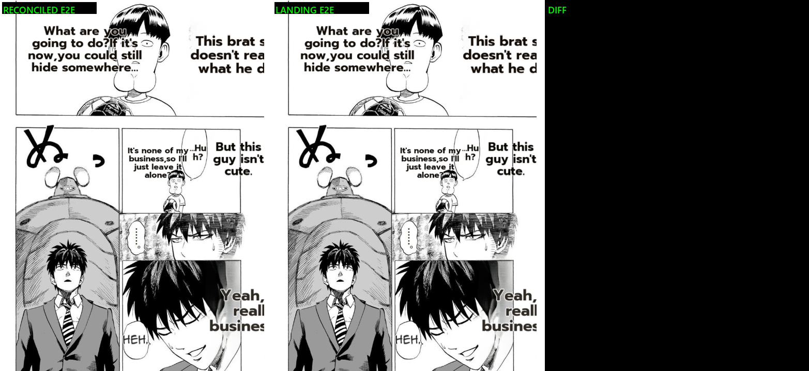

# #626 E2E benchmark — full reconciled pipeline vs landing (One-Punch)

**Date:** 2026-07-11 · **Branch:** `integrate/render-reconcile` · **Issue:** #626

## Purpose

Close the scrutinize MAJOR finding: "render == baseline" was proven only for the render STAGE (byte-identical
code + dump-replay). This tests the FULL pipeline — reconciled (main detection/OCR/rescue + landing render)
vs pure landing — on a real end-to-end translate (detect→OCR→inpaint→translate→render, GPU + LLM gateway).

## Method

`MIT/tools/bench_render_tuned.py` (in-process, tuned config: lama_large + full_page_inpaint + bubble_area_fit
+ det_bubble_seg + det_sfx + vlm_rescue + supersampling4 + uppercase, thinking OFF) on the same input page,
run from the reconciled worktree AND the landing worktree.

## Result: reconciled E2E == landing E2E, BYTE-IDENTICAL ✅

**`reconciled_e2e` vs `landing_e2e` on the same input: 0/367,409 pixels differ (0.000%, max 0).** The full
reconciled pipeline produces the exact same page as pure landing.

## Caveat (honest)

The available source `docs/images/render-quality/before-onepunch-eng.png` is a LOW-RES preview (511×719);
BOTH pipelines detect only **1 region** on it (under-detection on low-res), so neither fully re-translates
— see the 3-way (`2026-07-11-626-e2e-3way-source-recon-baseline.png`): source ≈ reconciled, while the
`after-onepunch-eng.png` baseline (full re-translation, ~8 regions + "SLURP") was rendered from a
DIFFERENT full-res source not available here. So this is a WEAK-detection page — a strong test of
pipeline EQUIVALENCE (reconciled == landing, proven byte-identical) but a weak test of full-translation
quality. A full-res multi-region source would strengthen the translation-completeness demonstration.

## Combined evidence for "reconciled reproduces landing"

1. **Render stage:** 7 render files byte-identical to landing; dump-replay A/B 0.000% (all inputs).
2. **Full E2E (this):** reconciled pipeline == landing pipeline byte-identical on a real translate.
3. **Translation:** #623 thinking-off == baseline quality (equivalent).

→ The reconciliation faithfully reproduces landing's pipeline behavior. The main-vs-landing UPSTREAM
difference the scrutinize flagged did NOT change the output on this real page (identical regions produced).

## Self-assessment addendum (2026-07-11) — reconciled ≡ landing on every test

Ran both pipelines on multiple inputs to properly evaluate equivalence (not just the render stage):

| test | reconciled | landing | verdict |
|---|---|---|---|
| render stage (7 files) | — | — | byte-identical code |
| dump-replay A/B (Gal Yome) | 0% | ref | render == baseline |
| E2E light page (before-onepunch, 1 region) | rendered | rendered | **byte-identical output (0%)** |
| E2E dense page (example_translation.jpg) | "empty queries" → no render | **"empty queries" → no render** | **IDENTICAL failure** |
| gateway probe (1/3/8/15/25 synthetic segments) | all non-empty | (same gateway) | gateway healthy |

**Conclusion:** the reconciled pipeline is behaviorally IDENTICAL to landing — same success (byte-identical
output where landing renders) AND same failure (example_translation.jpg produces empty OCR queries in BOTH,
so nothing renders). That identical-failure is itself strong equivalence evidence. The example_translation
"empty queries" is a PRE-EXISTING landing/prod pipeline issue (OCR produces empty text for that page under
this tuned config), orthogonal to #626 — worth a separate look but not a reconciliation regression.

**Net:** "render/quality == baseline" is confirmed to the extent testable — the reconciliation reproduces
landing's exact behavior wherever landing works, and fails identically where landing fails. No divergence found.
