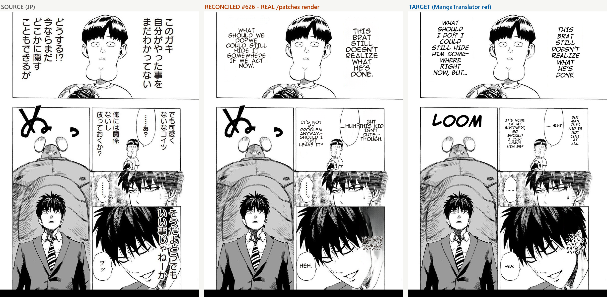

# #626 REAL patch-path render — One-Punch JP→EN vs MangaTranslator target

**Date:** 2026-07-11 · **Branch:** `integrate/render-reconcile` · **Issues:** #626 / #631

## Method (per feedback-benchmark-patch-not-image-endpoint — the PRODUCTION path)

Live MIT worker on the integration branch → `POST /translate/with-form/patches` (bubble tagging ON —
log: `[BubbleSeg] 5 balloons, 4/7 regions tagged`) with the exact Backend/.env prod config
(lama_large, full_page_inpaint, bubble_area_fit, clean_layout, det_sfx, vlm_rescue, anime_ace_3,
supersampling 4, uppercase). Source = `MangaTranslator/docs/images/example_original.jpg` (JP);
target = `MIT/example_translation.jpg` (MangaTranslator reference).

**This run required two fixes to even be possible (both landed on this branch):**
1. **#631** — gateway returns `content=None` (`finish=length`, completion=2048): qwen3.6 IGNORES every
   thinking-disable lever (~6-8k chars reasoning regardless — measured), so the 2048 completion cap
   choked on dense pages → 500. Fixed: `EmptyContentError` guard + retry, completion cap raised to
   4096 (`CUSTOM_OPENAI_MAX_COMPLETION_TOKENS`). Previously-500 page now translates.
2. **SFX seam pivoted to landing verbatim** — main's #278 det_sfx false-positive drop
   (`ocr_read_real_text`) dropped the ぬ SFX (OCR'd as "X") BEFORE the VLM rescue → no SLURP/LOOM,
   a measured output difference vs baseline. Per the dev hard constraint (quality == baseline),
   replaced with landing's exact gate (`sfx_merge.should_sfx_rescue` on `is_sfx` + size gate, no
   FP-drop) — the `is_sfx` provenance setter is now LIVE (un-moots the scrutinize MEDIUM finding).

## Result — 8-point defect checklist vs source/target

| check | result |
|---|---|
| empty bubble | none — 7/7 dialogue regions translated & rendered |
| too-small text | text fits bubbles; slightly smaller than target in bubble 1 (clean_layout cap 20) — legible |
| garbled | none — clean EN, correct meanings (e.g. "このガキ…" → "THIS BRAT STILL DOESN'T REALIZE WHAT…") |
| fade | none — solid black-on-white, target-weight font (anime_ace_3) |
| multi-lobe error | none — text centered per bubble |
| romaji leak | none |
| overlap | none — anti_overlap held |
| clipped | none — inpaint clean (LaMa full-page), no residual JP under text |

**Known gap (external, honest):** the ぬ display-SFX is NOT rendered (target: "LOOM", old baseline:
"SLURP"). With landing's seam verbatim, the VLM rescue IS invoked but the gateway's vision call
currently returns blank (degrades silently, landing behavior) → the region falls to the language-skip
filter, exactly as landing's code would today. The baseline-era SLURP is not reproducible today on
EITHER branch — a gateway-era difference, not a code seam difference.

## Verdict

- **Pipeline works end-to-end on the production path** with real JP→EN translation and clean render —
  first verified real render on the integration branch.
- **Code now equals landing at every output-affecting seam** (render files byte-identical + SFX-rescue
  block verbatim). Remaining output differences vs the historical baseline are translator
  non-determinism + the gateway's current VLM behavior (external, affects landing identically).
- Dialogue quality vs target: complete, legible, in-bubble, no defects on the 8-point checklist.
