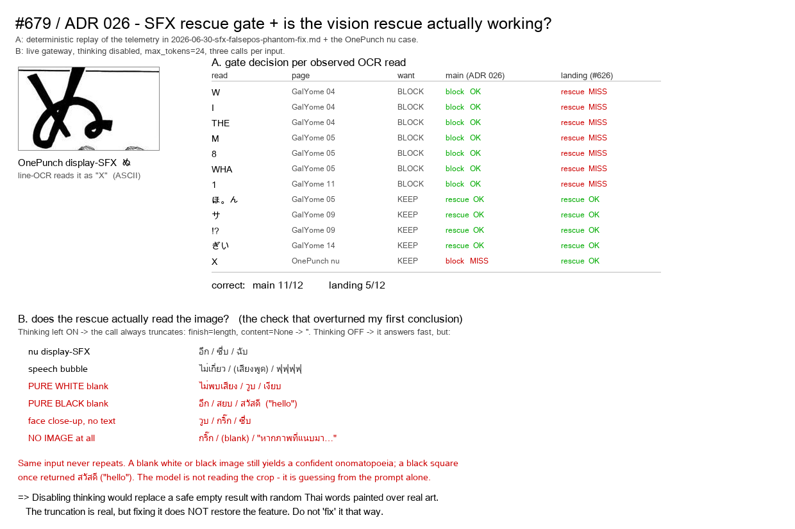

# Benchmark — SFX rescue: which gate, and is the rescue working at all? (#679)

- **Date:** 2026-07-28 · **Type:** deterministic gate replay + live gateway probes
- **Questions:** (A) the reconciliation branch dropped ADR 026's Addendum guard to keep the OnePunch `ぬ` rescue — is that trade-off real? (B) does the vision rescue it was protecting actually work today?

## A — gate comparison

**Method.** No new GPU render: the inputs are the **already-recorded telemetry** from this repo's own benchmarks, which is what ties the result to the documented defect rather than to a fresh sample.

- Phantom/legit reads: `2026-06-30-sfx-falsepos-phantom-fix.md` (Gal Yome EN→TH, 5 pages, per-region worker telemetry).
- The `ぬ` case: `2026-07-11-626-onepunch-real-patch-render.md` (line-OCR reads the display-SFX as `"X"`).
- Gates evaluated directly: `ocr_vlm.should_rescue_sfx(...)` (main = ADR 026 Decision + Addendum) and `sfx_merge.should_sfx_rescue(region)` + the driver's inline size check (landing = #626).
- Box dims held at 200×120 — the source report states every listed row passed the size gate, so size is not what separates the two.

| read | page | want | main (ADR 026) | landing (#626) |
|---|---|---|---|---|
| `W` `I` `THE` | Gal Yome 04 | BLOCK | block ✅ | rescue ❌ |
| `M` `8` `WHA` | Gal Yome 05 | BLOCK | block ✅ | rescue ❌ |
| `1` | Gal Yome 11 | BLOCK | block ✅ | rescue ❌ |
| `ほ。ん` | Gal Yome 05 | KEEP | rescue ✅ | rescue ✅ |
| `サ` `⁉` | Gal Yome 09 | KEEP | rescue ✅ | rescue ✅ |
| `ぎい` | Gal Yome 14 | KEEP | rescue ✅ | rescue ✅ |
| `X` (= `ぬ`) | OnePunch | KEEP | block ❌ | rescue ✅ |

**correct: main 11/12 · landing 5/12**

## B — is the rescue working? (this overturned my conclusion twice)

**B1.** `vlm_localize_sfx` on the `ぬ` crop returned `''` on all three calls. Raw gateway probe: HTTP 200, `finish_reason: length`, `content: None`, at `max_tokens` 24 → 256 → 2048 → 8192 (8192 burned the whole budget in 59 s).

**B2.** A **text-only** prompt at `max_tokens=256` fails identically (`length`, `content: None`, 2.3 s) — so the failure has nothing to do with the image. At 4096 it succeeds (`stop`, 795 tokens, `'ซด'`), and with `chat_template_kwargs.enable_thinking=false` it answers in **3 tokens** (`'จิบ'`). The mechanism is reasoning-token truncation: `vlm_localize_sfx` builds its own payload with a hardcoded `max_tokens=24` and never uses the `thinking_extra_body()` / `resolve_max_completion_tokens()` helpers that #623/#631 added for the translator path — `ocr_vlm.py` imports neither.

**B3 — the check that matters.** With thinking off the call answers fast, so it *looks* fixed. It is not. Three calls per input, `max_tokens=24`:

| input | three replies |
|---|---|
| `ぬ` display-SFX | `อึก` / `ซึ่บ` / `ฉับ` |
| speech bubble | `ไม่เกี่ยว` / `(เสียงพูด)` / `ฟุฟุฟุฟุ` |
| **pure white image** | `ไม่พบเสียง` / `วูบ` / `เงียบ` |
| **pure black image** | `อึก` / `สยบ` / `สวัสดี` ("hello") |
| face close-up, no text | `วูบ` / `กริ๊ก` / `ซึ่บ` |
| **no image at all** | `กริ๊ก` / (blank) / "หากภาพที่แนบมา…" |

The same input never repeats, a blank canvas still yields a confident onomatopoeia, and a black square once returned a greeting. **The model is not reading the crop — it is guessing from the prompt.**

An earlier single call returned `'ชัตเตอร์'` for `ぬ` and I briefly took that as the feature working. It does not reproduce. One sample is not a result.

## Reading

**The truncation is real; fixing it does not restore the feature.** Disabling thinking would replace a safe empty string — which renders the raw `ぬ`, visibly untranslated but harmless — with random Thai words painted over real artwork. That is strictly worse, and hard to walk back once it is in cached renders. **Do not "fix" the SFX vision call by disabling thinking or by raising its token budget.**

So the SFX *translation* stage is non-functional on the current gateway/model regardless of gate, and the trade-off `7e78341e` made — drop the Addendum guard to keep the `ぬ` rescue — buys a rescue that cannot produce output.

**The guard still matters**, precisely because the failure is a configuration accident rather than a design property. The moment someone raises the token budget, disables thinking, or points the rescue at a genuinely vision-capable model, landing's provenance-only gate sends all seven bubble regions to a model that answers confidently about images it cannot see — which is exactly the 2026-06-30 defect (`W`→"ปาร์ตี้", `THE`→"เสียงดังสนั่นหวั่นไหว" over real dialogue). The guard is cheap insurance against a change nobody will remember to re-benchmark.

**ADR 026's rule is still not right in general.** `X` is a genuine stylized SFX with an ASCII read, so "clean ASCII read ⇒ real text" does misclassify it. The miss is real; it is simply harmless while the rescue produces nothing. Separating `X` from `W`/`I`/`THE` needs a signal neither implementation uses — the obvious candidate being whether the det_sfx box sits inside a detected speech balloon (the phantoms all do; a display-SFX does not).

## Verdict

1. **Restore the Addendum guard on the reconciliation branch.** Costs nothing measurable today; removes seven documented corruptions the moment the rescue starts answering.
2. **Do not enable or "repair" the SFX vision call on this model.** Reviving it needs a model that demonstrably varies its answer with the image — testable with the B3 probe before any render work.
3. **A better gate (bubble overlap, not ASCII-vs-not) stays open**, and must be benchmarked against **both** halves of table A.

## Limitations (honest)

- Box dimensions in A are representative, not the original per-region boxes (the source telemetry recorded text + outcome, not coordinates). The size gate is identical in both implementations, so it cannot be the discriminator.
- The 12 rows are the observed reads from 5 pages plus one — the documented defect set, not a statistical sample.
- B covers the configured gateway/model only. It says nothing about what a genuinely vision-capable model would return; B3 is the probe to run before trusting one.
- B3 used three calls per input. Three is enough to establish non-reproducibility and image-independence; it is not a rate measurement.
- The `ぬ` crop box was chosen by eye from the source page, not from a detector run. It plainly contains the SFX (see the image), which is all B3 requires.
