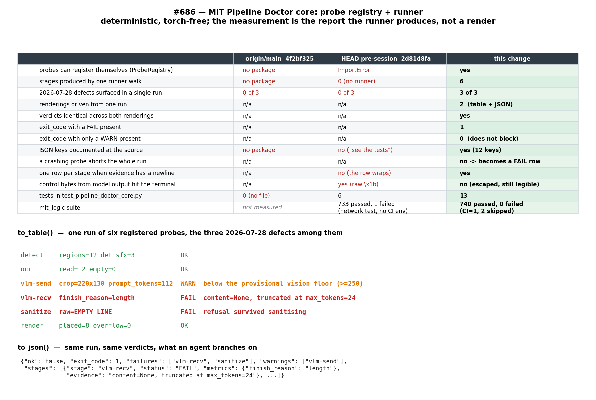

# #686 — Pipeline Doctor core: probe registry + runner

**Date:** 2026-08-31 · **Type:** new torch-free tool package (no pipeline code touched; no render logic)



## Method

Deterministic and torch-free. This change adds a **tool**, not a render path, so the meaningful
measurement is **the report the runner produces**, not a stochastic page render — the same reasoning
as `2026-07-09-608-stage-c-rewire.md`, where the change was a re-wire and the measurement was the
call graph.

The measured artifact is the PRD's own acceptance shape: a **fake probe set** registered on a
`ProbeRegistry`, walked once by `ProbeRegistry.run()`, rendered through both `to_table()` and
`to_json()`. Six probes cover stages named in `PIPELINE.md` §3–4; three of them are the 2026-07-28
defects from `docs/reports/benchmarks/2026-07-28-679-sfx-gate.md`.

Nothing here calls a GPU, the gateway, or the pipeline. Reproduce with:

```sh
cd MIT && pytest test/test_pipeline_doctor_core.py -q   # 13 passed
cd MIT && CI=1 pytest test/ -q                          # the mit_logic gate: 740 passed, 2 skipped
```

## Before → After

Three states, because the package is new on this branch: `origin/main` has no Doctor at all,
`HEAD` (`2d81d8fa`) carried the report model and the two renderers but **no runner and no probe
registration**, and this change adds the seam the rest of #685 plugs into.

| | `origin/main` `4f2bf325` | `HEAD` pre-session `2d81d8fa` | this change |
|---|---|---|---|
| probes can register themselves (`ProbeRegistry`) | no package | `ImportError` | yes |
| stages produced by one runner walk | no package | 0 (no runner) | 6 |
| 2026-07-28 defects surfaced in a single run | 0 of 3 | 0 of 3 | **3 of 3** |
| renderings driven from one run | n/a | n/a | 2 (table + JSON) |
| verdicts identical across both renderings | n/a | n/a | yes |
| `exit_code` with a `FAIL` present | n/a | n/a | 1 |
| `exit_code` with only a `WARN` present | n/a | n/a | 0 (does not block) |
| JSON keys documented at the source | no package | no (`"see the tests"`) | yes (12 keys) |
| a crashing probe aborts the whole run | n/a | n/a | no → becomes a `FAIL` row |
| one row per stage when the evidence has a newline | n/a | no (the row wraps) | yes |
| control bytes from model output reach the terminal | n/a | yes (raw `\x1b`) | no (escaped, still legible) |
| tests in `test_pipeline_doctor_core.py` | 0 (no file) | 6 | 13 |
| `mit_logic` suite | *not measured* | 733 passed, 1 failed (network test, no `CI` env) | **740 passed, 0 failed** (`CI=1`, 2 skipped) |

`HEAD`'s renderers were already correct; what was missing is the half of the issue title that reads
**"runner"**. Its own docstring claimed it (*"The Doctor's report model and runner"*) while `probe`,
`register` and `runner` appeared in the package **only inside prose docstrings** — zero code:

```sh
$ grep -rniE "probe|register|runner" MIT/tools/pipeline_doctor/*.py
__init__.py:3:  ... Probes                                  # docstring
report.py:1:    ... every Doctor probe reports through       # docstring
report.py:6:    #: A probe's verdict ...                     # comment
report.py:13:   """One pipeline stage as a probe saw it."""  # docstring
```

The `mit_logic` row's `HEAD` and `this change` cells were run under different `CI` settings, which is
why the failure count moves: `test_online_translators` is `skipif(os.environ.get('CI'))`
(`test/test_translation.py:42-46`, #618) and exercises live online translators, so it fails locally
without keys and is skipped in CI. `origin/main`'s suite was **not** run — the honest cell is empty
rather than back-computed.

## RED → GREEN

Two slices, and they had different kinds of red.

| slice | RED | GREEN |
|---|---|---|
| 5 runner / registration tests | `ImportError: cannot import name 'ProbeRegistry' from 'tools.pipeline_doctor'` | 11 passed |
| 2 renderer-hardening tests | `AssertionError: no raw control byte reaches the terminal` + `assert len(lines) == 2` | 13 passed |

The first is an **absence** red: it proves the symbol was missing, not that the new assertions can
fail. Each was therefore mutation-checked against the finished implementation. Every mutation reddens
exactly the test that names the behaviour, and nothing else:

| mutation | result |
|---|---|
| `sorted(self._probes)` instead of registration order | 2 failed, 9 passed — order + acceptance tests |
| drop the `if report is not None` guard | 1 failed, 10 passed — the "does not apply" test |
| let a probe crash propagate instead of becoming `FAIL` | 1 failed, 10 passed — the crash test |
| stop handing the page to the probe (`fn(None)`) | 1 failed, 10 passed — the order/context test |
| `_one_line` becomes the identity | 2 failed, 11 passed — both hardening tests |

The second slice's red is behavioural — it failed on its own assertion against real code — so it
needed no such proof, but the mutation is recorded above for symmetry.

## The renderer hardening (found by `/scrutinize`, fixed here)

`to_table` promises *"one row per stage"* in its docstring and the suite asserts `len(lines) == 2`.
Traced against real inputs, it broke that promise on text a probe is expected to carry:

```
evidence='refused:\nEMPTY LINE'   ->  2 reports rendered as 3 lines; the status column stopped lining up
metrics={'raw': '\x1b[31m...'}    ->  raw ESC reached the terminal verbatim
```

Both are the same root cause — arbitrary probe-supplied text formatted straight into a terminal row —
and the evidence a probe carries for the LLM stages is a string **the model wrote** (`#685`'s own
example is `raw='EMPTY LINE'`). `\x1b[2J` clears the screen and `\x1b[31m` recolours what follows, so
a `FAIL` row could be dressed up as anything. `_one_line` (`report.py`) escapes control characters
rather than stripping them, because *which* bytes came back is the diagnosis; `to_json` is
deliberately left verbatim, since JSON encoding already escapes them and an agent should receive
exactly what the model sent. Fixing it in the renderer rather than in each probe is what keeps every
later probe from having to remember.

## Torch-free (the `mit_logic` gate requirement)

Measured, not assumed — after importing the package, `sys.modules` contains **no** module whose root
is `torch`, `cv2`, `transformers`, `numpy`, or `manga_translator`. The core imports only
`dataclasses` and `typing`. The gate runs the whole `test/` directory, so the file is collected.

## Assessment

- **fix-root:** yes — the gap was the runner/registration seam itself, not a symptom of it. `#685`'s
  remaining deliverables attach by importing the package and decorating with
  `@doctor.probe('<stage>')`; nothing about them requires the core to learn what a stage is, which is
  what keeps it torch-free.
- **no-regression:** additive. The diff touches only `MIT/tools/pipeline_doctor/`, its test file, and
  this report — no pipeline code, matching #686's stated scope. `CI=1 pytest test/ -q` is
  740 passed / 2 skipped / **0 failed**.
- **completeness:** every #686 acceptance clause is exercised by a test, including the one that was
  previously unmet ("a fake probe set produces both renderings from one run").
- **limitation — a run where every probe declines reports `ok: True, exit_code: 0` with zero stages.**
  A CI gate wired to this would go green having inspected nothing. The core cannot fix this alone: it
  has no notion of which stages *should* have reported. It belongs to #685's CI-wiring deliverable,
  which must assert an expected stage set rather than trusting a zero-row pass. Recorded here because
  it is invisible until it matters.
- **limitation — the registered stage id and the reported one can disagree.** A probe registered as
  `detect` may return `StageReport('ocr', …)` and `failures` will say `ocr`; the crash path uses the
  registered id instead. Harmless with today's fake probes, a misattribution footgun for the real
  ones. Convention for now, not enforced.
- **limitation:** this is the core only. There is **no CLI yet** — the PRD's
  `python tools/pipeline_doctor.py <page> [--live]` and the `PIPELINE.md` section are deliverables 6–7
  of #685 and are deliberately out of #686's scope. The probes here are fakes by design. The vision
  floor (`>=250`) appears only as fixture text and remains provisional — one measurement, per #685's
  own risk note.
