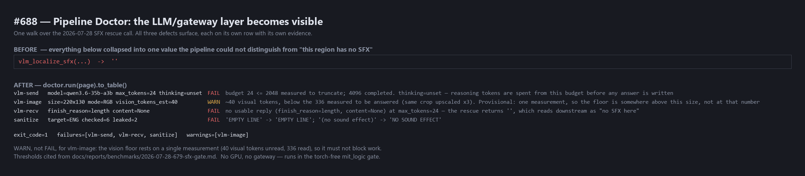

# Benchmark — Pipeline Doctor: do the LLM contracts actually surface the 2026-07-28 defects? (#688)

- **Date:** 2026-08-31 · **Type:** deterministic contract replay (no GPU, no gateway)
- **Question:** #685's acceptance bar is *"the Doctor must surface **all three** 2026-07-28 defects
  in a single run, each with its own stage line and evidence — that is the falsifiable bar, not
  'the tool exists'."* Does it?



## Method

One walk of the shared probe registry over one `DoctorPage`, carrying one SFX rescue call captured
from **production code**: `capture_sfx_call` runs the real `manga_translator.ocr_vlm.vlm_localize_sfx`
with its `post_fn` seam filled by a recorder, against the response the gateway actually returned on
2026-07-28 (`finish_reason: length`, `content: None`). Prompt assembly, PNG encoding, response
parsing and sanitising are all shipping code — only the HTTP call is replaced.

The crop is the `ぬ` display-SFX at the size the pipeline sends it (220×130). Nothing here calls a
GPU or the gateway, so the whole thing runs in the torch-free `mit_logic` gate.

## Result — the bar is met

| # | defect (2026-07-28) | row | verdict | evidence the row carries |
|---|---|---|---|---|
| 1 | `max_tokens=24` hardcoded, thinking flag never applied | `vlm-send` | **FAIL** | `budget 24 <= 2048 measured to truncate; 4096 completed. thinking=unset` |
| 1b | the truncation was **silent** — `''` is indistinguishable from "no SFX here" | `vlm-recv` | **FAIL** | `finish_reason=length, content=None at max_tokens=24 — the rescue returns ''` |
| 2 | crop sent below the vision-resolution floor | `vlm-image` | **WARN** | `~40 visual tokens, below the 336 measured to be answered (same crop upscaled x3)` |
| 3 | `sanitize_sfx` passes the prompt's own refusal wording through | `sanitize` | **FAIL** | `'EMPTY LINE' -> 'EMPTY LINE'; '(no sound effect)' -> 'NO SOUND EFFECT'` |

`exit_code=1`, `failures=[vlm-send, vlm-recv, sanitize]`, `warnings=[vlm-image]`.

For a Thai target the `sanitize` row leaks three of five instead of two of six — the non-Latin
branch guards Latin refusals only, so B3's live replies come straight through:

```
sanitize  target=THA checked=5 leaked=3  FAIL  'ไม่พบเสียง' -> 'ไม่พบเสียง'; '(เสียงพูด)' -> 'เสียงพูด'; 'ไม่เกี่ยว' -> 'ไม่เกี่ยว'
```

## Where every threshold comes from

All four are measurements from `2026-07-28-679-sfx-gate.md`, cited at the constant that uses them:

| constant | value | measurement |
|---|---|---|
| `BUDGET_MEASURED_TRUNCATING` | 2048 | B1 — 24 / 256 / 2048 all returned `length` + `content: None` |
| `BUDGET_MEASURED_COMPLETING` | 4096 | B2 — answered in 795 tokens |
| `VISION_TOKENS_MEASURED_ANSWERING` | 336 | the crop upscaled ×3 is answered; native 220×130 (≈40 tokens) is not |
| refusal corpus | 6 Latin / 5 Thai | the forms the model actually emitted (B3), plus already-filtered controls |

**Two bands are deliberately `WARN`, not `FAIL`, because nobody located their boundary** (#688 U1):

- the vision floor rests on a **single** measurement, so 336 is only *a size that worked*, not the
  floor. The true floor is somewhere in (40, 336]. It must never block work.
- a budget between 2048 and 4096 is simply unmeasured.

## Is the suite load-bearing? — mutation results

A green suite proves nothing unless it goes red when the behaviour breaks. Six mutations, each
applied in isolation and reverted (baseline: 20 passed):

| mutation | result |
|---|---|
| budget floor 2048 → 0 | **2 failed** |
| vision floor 336 → 1 | **3 failed** |
| drop the two leaking refusal forms from the corpus | **2 failed** |
| capture a hand-written body instead of the real call | **9 failed** |
| blank-canvas check removed | **1 failed** |
| `vlm-recv` always OK | **3 failed** |

The fourth is the one that matters: it is the difference between a probe that watches production
code and a probe that watches a copy of it.

## One defect found in this work's own tests

`test_the_contracts_import_without_torch` first asserted `'torch' not in sys.modules` inline. That
passes in CI — where torch is not installed — and **fails locally** the moment any earlier test
module imports the pipeline. It measured the suite's import order, not the module's import graph,
and would have been green in exactly the environment that cannot detect a regression. Caught by the
full local run (`767 passed, 2 failed`), rewritten as a subprocess check, and confirmed with a
negative control (the probe returns 1 when `torch` is imported alongside).

## Limitations (honest)

- **These contracts never ask the live model anything.** They check what we build and what we
  parse. Whether a newly configured model can actually *see* the crop is B3's question and #689's
  deliverable; nothing here can answer it.
- **The vision floor is one measurement**, restated because it is the most likely thing to be read
  as settled. 336 is a point that worked, not a boundary.
- **The corpus is what the model emitted on the days it was observed**, not an enumeration of
  refusal forms. A model that declines in new wording leaks until the corpus is extended.
- **The token count is an estimate**, from Qwen2/3-VL's 28 px-per-visual-token grid, not a
  tokeniser. It tracks what a resize changes, which is what the contract needs.
- The `vlm-send` and `vlm-recv` rows describe the SFX rescue path only. The translator path stays
  outside the gate — see the disposition of **D1** on #688.

## Verdict

The acceptance bar is met: three defects, four rows, each naming its own evidence, in one walk,
with no GPU and no gateway. The Doctor does **not** fix any of them — it makes them nameable, which
is what turns the next occurrence into a five-minute diagnosis instead of the ten hand-written
probes that 2026-07-28 cost.
