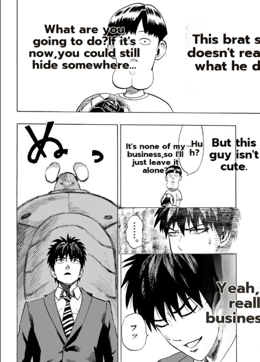
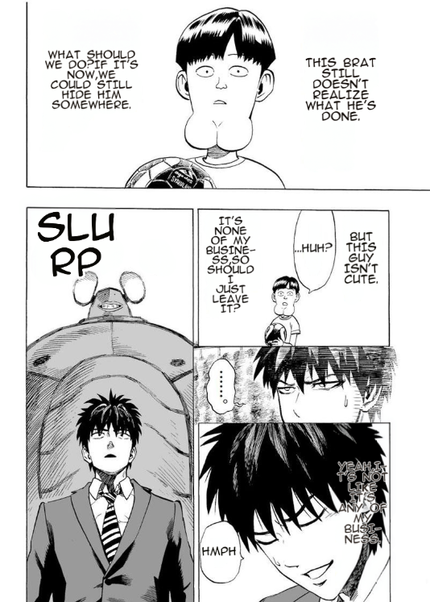
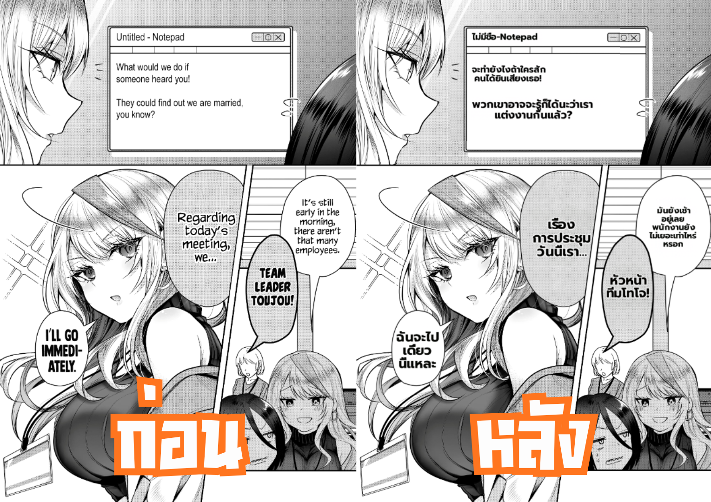

# MIT — Benchmark, Defects Found & Resolutions (for presentation & thesis)

> Presentation/report-focused write-up of the MIT translation benchmark: the controlled before/after,
> the defect taxonomy we surfaced, and the engineering resolution for each. Audience: viva committee +
> thesis chapters 3–4. Honesty-first — what is measured vs. expected, what is fixed vs. in-progress.
> Sources: `MIT/BENCHMARK.md`, `docs/research/mangatranslator-internals.md`, ADR 003/005, this team's measurements.

---

## 1. Benchmark setup

- **Reference page:** One-Punch Man (`chapter "Benchmark Pipeline MIT"`), 1 page, JA→EN.
- **The bar (baseline):** meangrinch/MangaTranslator's EN render of the same page (`MIT/example_translation.jpg`).
- **Method:** controlled A/B on a *fixed* page, re-run after every pipeline change, scored as a **dimension scorecard** (not a single number). Automated via `MIT/tools/ab_benchmark.py` → `benchmark_compare.png` (left = ours, right = reference).
- **Why a fixed page:** isolates pipeline changes from content variance — a reproducible visual regression test for translation quality.

## 2. Before → After (the measured result)

| | Before (2026-06-08) | After (knobs on + techniques ported) |
|---|---|---|
| Visual render parity vs reference | **~40–50%** | **~90–95%** |
| Screenshot | see below ↓ | see below ↓ |

**Before (defects) → After (resolved)** — One-Punch Man, JA→EN:

| Before (2026-06-12) | After (2026-06-14) |
|---|---|
|  |  |

**Observable in the screenshots:**
- BEFORE: right-edge bubbles clipped ("This brat s…", "Yeah, reall busines…"); SFX left raw Japanese (`ぬめ`, `フッ`); mixed-case, cramped lettering; text under-fills bubbles.
- AFTER: text fits the bubble (narrow-column wrap); **SFX translated + styled** ("SLURP", "HMPH"); **ALL-CAPS comic lettering**, centred, manga-style; bubble-area fit.

### 2b. Phase 1.5 — the first version (EN→TH, standard page)

Our **first version (Phase 1.5)** already produced clean output on a *standard* page — here **EN→TH**:

*(left = ก่อน / source EN · right = หลัง / translated TH)*

What it shows — the **core capability working early**:
- **EN→TH translation** is clean and natural (incl. the in-panel **Notepad window** text — "ไม่มีชื่อ-Notepad… จะทำยังไงถ้าใครสักคนได้ยินเสียงเธอ!").
- **Thai typesetting fits the bubbles** with correct combining marks ("หัวหน้าทีมโทโจ!", "มันยังเช้าอยู่เลย พนักงานยังไม่เยอะเท่าไหร่หรอก").
- **Clean inpaint** on flat backgrounds.

**Why both examples matter (the narrative):** Phase 1.5 shows the **core translate + Thai-typeset pipeline works** on standard pages; the One-Punch benchmark (§2) then attacks the **hardest case** (complex art + SFX + narration boxes, JA→EN) and pushes render parity 40–50% → 90–95%. Together: *core capability* + *conquering the hard case*. The Thai output is also a market differentiator — Orange/Mantra are EN-focused.

## 3. Defect taxonomy — found, then resolved

The benchmark surfaced **five defect classes**. Each has an engineering resolution — none is a dead-end:

| # | Defect | Before | Technique / fix | Status |
|---|--------|--------|-----------------|--------|
| 1 | **Text overflow / edge clipping** | text spilled past bubbles, clipped at panel edges | narrow-column wrap (safe-area distance-transform) + bubble-area fit (binary-search font) + anti-overlap clamp | ✅ **fixed** |
| 2 | **Typesetting / lettering** | mixed-case, cramped, uncentred | ALL-CAPS + EN comic font + 4× supersampling + centred fit | ✅ **fixed** |
| 3 | **SFX (onomatopoeia)** | raw JA left untranslated (`ぬ`, `フッ`) | SFX detector (AnimeText YOLO, #168) + VLM-OCR rescue → translate + styled render ("SLURP"/"HMPH") | ✅ **fixed** |
| 4 | **Inpaint smoothness (LaMa)** | erase blurry/rough on complex art | **backend can select Flux** instead of LaMa (ADR 003) — cleaner on complex backgrounds | ✅ **resolved (knob)** — see §4 trade-off |
| 5 | **Wordplay / nuance** | puns & nuance flattened by the dev LLM | Alpha upgrades the LLM (off the dev-only Qwen3.6-35B) **+ cross-page context** (prior-page translations feed the next) | 🔵 **in progress** — expect improvement; must be *measured* (§5) |
| (6) | **Line-break quality** | rough hyphenation (`BUSINE-SS`) | Knuth-Plass optimal line-breaking (#180) | 📋 **planned** |

The techniques in 1–3 were **studied from open-source** (MangaTranslator / zyddnys: narrow-column, supersampling, bubble-seg, SFX, ALL-CAPS) and ported behind opt-in knobs — that is what lifted parity 40–50% → 90–95%.

## 4. Resource efficiency (the design that frames it)

| Mode | VRAM (12 GB card) | Use |
|---|---|---|
| **LaMa** (default) | **~6 GB** | most pages — fast, light. *Documented "hard constraint" — ADR 005: "it already uses ~6 GB of a 12 GB card."* |
| **Flux Klein** (opt-in, ADR 003) | **~10 GB** | complex-art pages where inpaint smoothness matters |

Both modes fit a **single 12 GB consumer GPU**. By contrast, MangaTranslator stacks **YOLO×2 + SAM + FLUX + OSB AnimeText-YOLO + manga-ocr/PaddleOCR-VL** (~22 model types) → much heavier VRAM (`docs/research/mangatranslator-internals.md`).

> **Differentiator:** *we use large models only where needed* — LaMa-light by default, Flux as a quality knob — achieving ~90–95% render parity on consumer hardware, where the reference stack needs far more. (Quick-win to make it a hard number: measure MangaTranslator's actual VRAM.)

## 5. Honest limitations & roadmap (say these in the viva)

- **Wordplay/nuance is the hardest class** — even the Japan Association of Translators centres its AI critique here. We *expect* the model+context upgrade to help, but **a claim needs measurement** — which points to the one real gap:
- **No translation-accuracy benchmark yet** (BLEU/COMET/human-eval on OpenMantra/Manga109). We have a **render-parity** benchmark (measured, reproducible); *translation-accuracy* is future work.
- **Flux is a knob, not free** — it buys inpaint quality at +4 GB VRAM and slower per-page; LaMa stays the default.
- **Alpha LLM ≠ dev LLM** — dev runs the free local Qwen3.6-35B (9arm); Alpha will use a stronger model (cost TBD) — state this so the cost story stays honest.

## 6. How to present / map to the thesis

- **Slide:** before/after screenshots side-by-side + the 5-class defect table (found → resolved) + the "40–50% → 90–95%" headline. This is the strongest MIT slide: *visual proof + honest defect analysis + roadmap.*
- **Narrative:** "We benchmarked against a strong reference, **found** five defect classes, **fixed** them with techniques studied from open-source (behind knobs), and have engineering resolutions for the rest (Flux / model+context / Knuth-Plass) — not dead-ends."
- **Thesis mapping:** บท3 (design — the pipeline + knob framework + ADR 003/005) · บท4 (implementation & testing — this benchmark = the test evidence) · บท5 (limitations & future work — accuracy benchmark, wordplay).
