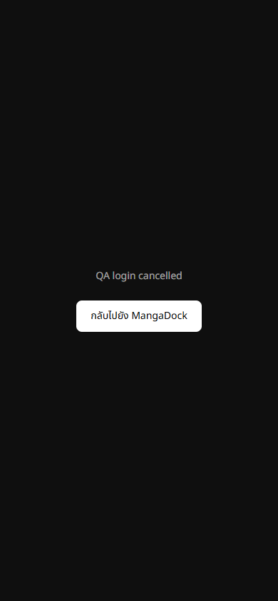
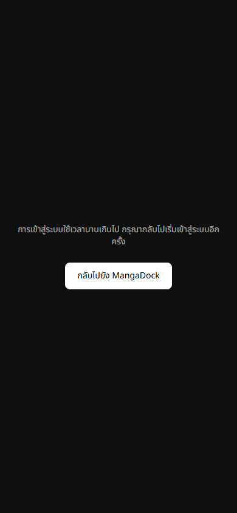
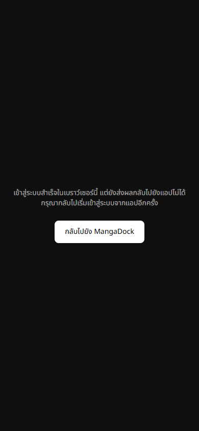

# Phase 3 auth delivery validation — 2026-10-01

## Changes on current main

- Callback finishes on INITIAL_SESSION or an already available session, handles URL
  errors, deduplicates completion and renders an explicit error after 15 seconds.
- Auth state notifications return synchronously. MFA, backend/profile and cache
  work execute outside the Supabase notification lock.
- Same-user token refresh does not cancel a pending MFA check. Identity changes
  invalidate pending profile work and cache responses before state/storage mutations.
- Auth cache clearing cancels pending history synchronization and never schedules
  deletion using the next account's token. Explicit user history deletion keeps its
  existing default remote synchronization behavior.
- Existing MFA, typed same-origin callback message envelope and Expo/native bridge
  protocol are preserved. This PR does not replace main's native implementation.

## Verification

| Check | Result |
|---|---|
| Auth/MFA/cache regressions | 12 passed |
| Canonical frontend Bun unit suite | 226 passed across 33 files |
| TypeScript and targeted ESLint | Passed |
| Next production build | Passed using local placeholder public Supabase config |
| Playwright, URL error | Explicit error and home link rendered |
| Playwright, missing session | Spinner replaced by an error after 15 seconds |
| Playwright, preexisting synthetic session | Standalone-browser completion message rendered |
| Independent source review | Findings fixed; authenticated device E2E not claimed |

The cache regression harness executes the real cache modules and safe JSON parser
with delayed fetch boundaries. Before generation guards, account A's late response
repopulated account B's favorites/history, and auth clearing could issue a DELETE
using B's token. Those cases fail before the fix and pass afterwards.

## Rendered comparison

The production callback with a synthetic `access_denied` URL error still rendered
the pending text when observed in an isolated Chrome context on 2026-10-01. The
local patched callback rendered the error with a navigation link.

| Production baseline | Patched local build |
|---|---|
|  |  |





## Reproduce

Run `npm run test:auth`, `npx tsc --noEmit`, and the repository's canonical Bun test
selector. Build with QA placeholder configuration and start Next on localhost:4010.
With Playwright installed in your tooling environment, run:

```powershell
$env:PLAYWRIGHT_MODULE='C:/path/to/tooling/node_modules/playwright'
$env:AUTH_QA_BROWSER='C:/Program Files/Google/Chrome/Application/chrome.exe'
node Frontend/tests/oauth-callback.e2e.cjs
```

Browser QA uses a synthetic session only on localhost with the placeholder Supabase
project. It does not validate real provider login, real MFA or backend reader access.
The placeholder build is not a production deployment artifact. Production Vercel
deployment remains pending PR review/merge and real environment configuration.

The user's earlier beta.2 Google/Facebook/session/reader/header acceptance remains
recorded separately from these source and synthetic browser tests.
