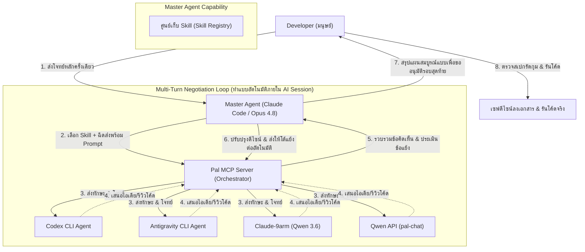

# สไลด์นำเสนอสถาปัตยกรรมกระบวนการพัฒนา (Agentic Workflow Presentation)

เอกสารสรุปสถาปัตยกรรมและกระบวนการทำงานร่วมกันของ AI เอเจนต์ที่ทีมพัฒนาสร้างขึ้นเอง สำหรับนำเสนออาจารย์ที่ปรึกษาโครงงาน

---

## 0. บทบาทของนักพัฒนา: จาก Coder สู่ Systems Architect ที่กำกับแบบ Human-in-the-Loop

**คำพูดที่ห้ามใช้ตรงๆ:** *"เราเขียนโค้ดเองน้อยกว่า 5%"* — ประโยคนี้เสี่ยงเปิดช่องให้กรรมการถามกลับทันทีว่า "แล้ว contribution ของนักศึกษาคืออะไร ถ้า AI เขียนแทนเกือบหมด" ต้อง reframe **ก่อน**กรรมการจะคิดเอง ไม่ใช่รอแก้ต่างทีหลัง

**Reframe ที่ใช้จริง:**
> เราเปลี่ยนบทบาทจากผู้ลงมือเขียนโค้ด เป็นผู้ออกแบบ**ระบบวิศวกรรมที่ควบคุมคุณภาพงานของ AI Agent** — ตั้งแต่นิยาม requirement (`/grill-me` → PRD), ตัดสินใจทางสถาปัตยกรรม (ADR), แตกงานเป็นสเปกแคบที่ agent ทำได้แม่นยำ (`/to-issues`), ไปจนถึงกำหนดเกณฑ์ผ่าน/ไม่ผ่านของแต่ละงานย่อยด้วย Test-Driven Development (`/tdd`)

**ทำไมไม่ใช่แค่ "Project Manager" เฉยๆ:** PM ทั่วไปสื่อถึงบทบาท coordination ไม่ใช่ technical — เสี่ยงโดนมองว่า "นี่คือวิชาบริหารโครงการ ไม่ใช่วิศวกรรม" สิ่งที่ทำจริงคือ **Human-in-the-Loop (HITL)** ซึ่งเป็น term ที่มีวรรณกรรมวิชาการรองรับในสาย ML/software engineering — ต้องเข้าใจ architecture ทั้งระบบเพื่อสั่งงานและตรวจทานผลลัพธ์ของ AI Agent ทุกขั้น ไม่ใช่ปล่อยให้ทำงานอิสระโดยไม่มี verification gate

**ทำไมไม่ใช่แค่ "ลดภาระงาน":** ภาระงานถูก**ย้ายจุด** ไม่ใช่ลดลง — จาก "ภาระเชิงปริมาณ" (พิมพ์โค้ดเอง) ไปเป็น "ภาระเชิงคุณภาพ" (ต้องเข้าใจ architecture ลึกพอจะรีวิวและจับ error ของ agent ได้ ซึ่งยากกว่าการเขียนเองในหลายจุด) เวลาที่ประหยัดจากการไม่ต้องพิมพ์โค้ดเอง ถูกทุ่มกลับไปที่งานที่มีมูลค่าสูงกว่า: ออกแบบสเปก, ตัดสินใจสถาปัตยกรรม, และตรวจสอบ

**หลักฐานที่ใช้ตอบคำถาม "ยกตัวอย่างสิ ที่ AI ทำผิดแล้วคุณจับได้":**
- **PRD/ADR/TDD spec ที่เขียนเอง** — พิสูจน์ judgment ทางวิศวกรรมเป็นของมนุษย์ ไม่ใช่ agent ตัดสินใจเอง (`docs/adr/`, `Documents/Plan/`)
- **3-4 เคสรูปธรรมจาก `docs/reports/bug-case-catalog.md`** — โดยเฉพาะเคสที่ AI วิเคราะห์ผิดแล้วถูกจับด้วย verification (เช่น "L2 mis-analysis" ใน `docs/reports/benchmarks/2026-07-03-mit-layout-fit-and-merge-optimize.md` ที่แม้แต่รอบ AI ค้าน AI เองก็ยังผิด จนต้องวัดจริงถึงจับได้)
- **Review/merge gate จริงในโปรเจกต์** — `/scrutinize` ก่อน merge ทุกครั้ง, benchmark ต้องยืนยัน defect หายจริงก่อนเคลมว่าเสร็จ ไม่ใช่แค่ "ดูดีขึ้น"

**สรุปสั้นสำหรับสไลด์:** **"จาก Coder → Systems Architect ที่กำกับ AI Agent แบบ Human-in-the-Loop"** — วัดผลได้จาก artifact ที่มนุษย์เป็นคนสร้าง (spec/decision/gate) ไม่ใช่จากปริมาณโค้ดที่พิมพ์เอง

---

## 1. ปัญหาของกระบวนการพัฒนาทั่วไป (Software DX Problems)

* **ความซ้ำซ้อนและไร้ระเบียบ**: การคุยกับ AI เพื่อขอโค้ดโดยไม่มีขั้นตอนออกแบบล่วงหน้า มักนำไปสู่โค้ดที่ไม่ได้ประสิทธิภาพ (AI Slop)
* **ความเอนเอียงของคำตอบ (Model Bias)**: การอิงกับโมเดลเพียงค่ายเดียวสำหรับการออกแบบระบบซับซ้อน อาจทำให้ออกแบบผิดทิศทาง
* **ข้อจำกัดการถามตอบแบบรอบเดียว (Single-shot Limitation)**: การสั่งงานเอเจนต์แบบส่งไป-รับกลับรอบเดียว มักได้งานที่ไม่ละเอียดพอ ขาดการตรวจสอบและแก้ไขแบบโต้ตอบ
* **คอขวดเวลาการออกแบบระหว่างมนุษย์กับ AI (Human-AI Communication Bottleneck)**: หากบังคับให้เอเจนต์ตัวหลักต้องมานั่งคุยระดมสมองกับนักพัฒนา (Developer) ทีละคำถาม นักพัฒนาจะต้องคอยนั่งเฝ้าจอ พิมพ์ตอบขนาดยาว ซึ่งใช้เวลาและภาระทางสมองของมนุษย์สูงมาก

---

## 2. โครงสร้างระบบเอเจนต์ที่พัฒนาขึ้นเอง (Hybrid Multi-Agent Architecture)

เพื่อแก้ปัญหาข้างต้น ทีมเราได้พัฒนา Skill ชื่อ **`clink-brainstorm`** ขึ้นมา เพื่อสร้างกระบวนการ **Multi-Turn Negotiation Loop (วงจรการเจรจาต่อรองแบบหลายรอบ)** พร้อมระบบ **Dynamic Skill Injection (การฉีดทักษะแบบไดนามิก)**:



---

## 2.1 หลักการออกแบบ 5 ข้อ (Design Principles)

Skill นี้ชื่อ **`clink-brainstorm`** — แพ็กเกจเป็น installable skill จริง ไม่ใช่แค่แนวคิดภายในโปรเจกต์:

- **Parallel Execution via Clink (Pal MCP):** ยิงคำถามเดียวกันไปหลาย Agent ผ่าน Clink ของ Pal MCP — Gemini (Antigravity/agy), Codex, Claude-9arm (Qwen 3.6), และ Qwen API (pal-chat) ทำงานแบบ parallel
- **Delphi-Inspired Aggregation:** Master Agent เป็นคนตัดสิน ไม่ใช่ปล่อยให้ AI คุยกันเอง — แต่ละ Agent ตอบอิสระโดยไม่เห็นคำตอบกันเอง (คล้าย Delphi method ดั้งเดิม) จากนั้น Master Agent วิเคราะห์จุดเห็นด้วย/เห็นต่าง แล้วนำคำตอบจริงไปให้โต้แย้งต่อจนได้ข้อสรุป — *(หมายเหตุ: ส่วนรอบโต้แย้งด้านล่างไม่ใช่ Delphi ดั้งเดิม แต่เป็นการต่อยอดเพื่อลด bias ที่ Delphi เดี่ยวไม่ครอบ)*
- **Dynamic Skill Injection:** Master Agent ส่ง Skill ให้ Agent ปลายทางได้ผ่าน Prompt — ไม่จำเป็นต้องติดตั้ง skill เดียวกันไว้ล่วงหน้า Master Agent ส่ง context + workflow ที่ต้องใช้ไปพร้อมคำสั่งผ่าน Clink
- **Adversarial Round:** ถ้าทุก Agent เห็นตรงกัน จะยังไม่จบทันที — บังคับให้แต่ละตัวหาข้อโต้แย้งที่แข็งที่สุดต่อข้อสรุปก่อน เพื่อลด bias จากการเทรนข้อมูลคล้ายกัน
- **Human-in-the-Loop:** สิทธิ์ขาดรอบสุดท้ายอยู่ที่ Developer (มนุษย์) — Master Agent สรุปข้อดี/ข้อต่างและแผนสถาปัตยกรรมที่ผ่านการโต้แย้งมาแล้วมาให้อนุมัติก่อนเซฟลงเอกสารจริง

---

## 3. การเปรียบเทียบ: AI-to-AI vs. AI-to-Developer Brainstorming

ระบบการระดมสมองระหว่าง AI ด้วยกันเอง (Agent-to-Agent) มอบประสิทธิภาพที่เหนือกว่าแบบคุยกับมนุษย์ (Agent-to-Human) ในหลายด้าน:

| หัวข้อเปรียบเทียบ | แบบเดิม (AI คุยกับ Developer) | แบบใหม่ (AI คุยระดมสมองกันเอง) |
|---|---|---|
| **ภาระเวลาของมนุษย์** | **สูงมาก** (นักพัฒนาต้องคอยเฝ้าตอบคำถามทีละข้อ) | **ต่ำมาก** (มนุษย์ส่งเป้าหมายรอบแรก แล้วรอรีวิวผลสรุปรอบสุดท้าย) |
| **ความรัดกุมของแผนงาน** | ปานกลาง (มนุษย์อาจหลงลืมประเด็นทางเทคนิคเล็ก ๆ หรือ Edge Case) | **สูงมาก** (เอเจนต์ 4 ตัวสแกนโค้ดและค้านบั๊กกันเองอย่างถี่ถ้วน) |
| **ความเร็วในการร่างแผน** | ช้า (ขึ้นอยู่กับความเร็วในการพิมพ์และวิเคราะห์ของมนุษย์) | **เร็วมาก** (เอเจนต์คุยโต้ตอบผ่าน API ความเร็วสูงในเวลาไม่กี่นาที) |

---

## 4. ความหลากหลายทางมุมมองและพฤติกรรม (Cognitive Diversity of Agents)

การรวบรวมเอเจนต์ทั้ง 4 ตัวมาคุยกันใน Session เดียว ช่วยให้เราได้มุมมองที่แตกต่างรอบด้าน (360-degree perspectives) เนื่องจากแต่ละตัวมีจุดเด่นและลักษณะพฤติกรรมที่ต่างกัน:

* **Codex (Code-Centric)**: ตรวจทานความถูกต้องและรูปแบบไวยากรณ์ของโค้ดโดยตรง
* **Antigravity (System-Centric)**: วิเคราะห์ภาพรวมความเข้ากันได้และการอ้างอิงไฟล์ใน Directory เชิงลึก
* **Claude-9arm (Logic-Centric)**: ถกเถียงและวิเคราะห์ความสมเหตุสมผลเชิงตรรกะและประสิทธิภาพของโปรแกรม
* **Qwen API (Conceptual-Centric)**: เสนอแนวความคิด ทฤษฎี และไอเดียใหม่ ๆ แบบกว้างขวาง

---

## 5. ผลลัพธ์เชิงนวัตกรรม (Engineering Value)

> [!IMPORTANT]  
> **ฉันทามติหลายรอบผ่าน Context เดียว (Multi-Turn Multi-Model Consensus)**  
> ระบบนี้ก้าวข้ามการใช้ AI แบบแชตบอทถามคำตอบคำ แต่ทำให้ AI สวมบทบาทเป็น **"คณะกรรมการออกแบบระบบวิศวกรรม"** คุยเจรจาปรับปรุงดีไซน์ไปเรื่อย ๆ จนได้แบบแผนที่มีความสมบูรณ์สูงสุด คล้ายคลึงกับกระบวนการประชุมสถาปัตยกรรม (Architecture Review Board) ขององค์กรใหญ่

> [!TIP]  
> **การประหยัดกำลังสมองผู้พัฒนา (Developer Cognitive Load Reduction)**  
> การย้ายกระบวนการถกเถียงเชิงเทคนิคไปอยู่ในระดับ AI-to-AI ช่วยลดเวลาที่นักพัฒนาต้องมานั่งคิดทีละสเต็ป ทำให้แผนงานเสร็จเร็วขึ้นและรัดกุมขึ้นอย่างเห็นได้ชัด โดยนักพัฒนามีหน้าที่เป็นเพียง **"ผู้อนุมัติขั้นสุดท้าย (Final Approver)"** เท่านั้น

---

## 6. การติดตั้งและใช้งานจริง (Real Implementation, Not Just a Concept)

Skill นี้เป็นของจริงที่ติดตั้งและลองใช้ได้ ไม่ใช่แค่ diagram ทางทฤษฎี:

```bash
npx skills add xenodeve/xeno-skills
```

- ต้องมี **Pal MCP** ติดตั้งอยู่ + ตั้ง **Clink อย่างน้อย 2 ตัว** ก่อน เพื่อให้เกิดความหลากหลายของมุมมองจริง (1 ตัวเดียวไม่ต่างจากถาม AI ตัวเดียว)
- Skill: https://github.com/xenodeve/xeno-skills
- Pal MCP Fork (เพิ่ม Antigravity + Claude-9arm): https://github.com/xenodeve/pal-mcp-server

---

## 7. ข้อจำกัด — พูดก่อนถูกถาม (Limitations)

ตรงตามหลักเดียวกับที่ใช้ในสไลด์ MIT (`mit-presentation-defense.md` §4/§8): ยอมรับจุดอ่อนก่อนกรรมการถาม ดีกว่าปล่อยให้เจอเอง

1. **ต้นทุน token/เวลาสูง** — ยิ่ง agent เยอะ ยิ่งกิน token รวมกันมาก แนะนำให้ใช้เฉพาะเคสที่สำคัญหรือซับซ้อนจริง ๆ ไม่ใช่ทุกการตัดสินใจ
2. **Master Agent ต้องฉลาดพอที่จะตัดสินถูก** — ถ้า Master Agent สังเคราะห์ผิด ข้อดีของการมีหลายมุมมองจะสูญเปล่า (bottleneck ย้ายจาก "AI ตัวเดียวหลอน" ไปเป็น "Master Agent ตัดสินใจผิด" แทน ไม่ได้หายไปทั้งหมด)
3. **Correlated blind spot (ยังไม่มีทางแก้เป็นระบบ)** — ถ้า Agent หลายตัวเทรนจากข้อมูลใกล้เคียงกัน อาจ "เห็นตรงกันแต่ผิดพร้อมกัน" ซึ่ง Adversarial Round ก็จับไม่ได้ เพราะรอบโต้แย้งอาศัยความเห็นต่างระหว่าง agent เป็นสัญญาณ — ถ้าไม่มีความเห็นต่างตั้งแต่ต้น (เพราะ bias เดียวกัน) ระบบจะไม่รู้ตัวว่าพลาด จุดนี้ยังต้องพึ่ง human ที่ระแวงประเด็นนี้เองเป็นด่านสุดท้าย
